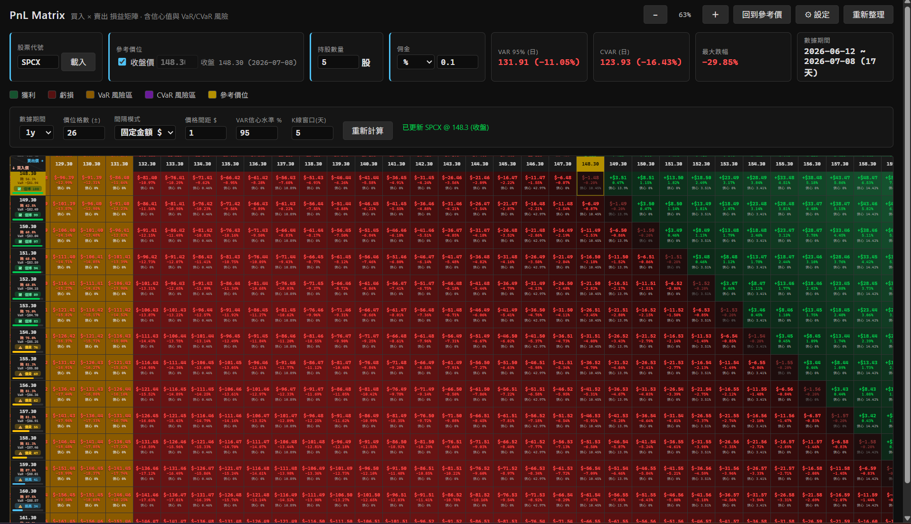

# PnL Matrix — 買賣損益矩陣與風險分析

以「買入價 × 賣出價」二維矩陣,視覺化每個買賣組合的損益,並結合
**信心值（K 線形態統計）** 與 **VaR / CVaR / 蝕錢機率（歷史報酬分佈）**,
輔助判斷某個價位「值不值得做 T」。



- 後端 `pnl_matrix.py` + `params.py`：用 `yfinance` 下載歷史股價,計算價位格、信心值與風險指標；CLI 與桌面 app 共用 `build_matrix_kwargs` 建參數。
- 前端 `pnl_matrix.html` + `pnl_matrix.css` + `pnl_matrix.js`：互動式矩陣（左鍵平移、滾輪縮放、十字準星、即時調整股量/佣金）。
- 桌面端 `app.py`：用 pywebview 包成原生視窗,計算結果直接在記憶體回傳前端（不需 `.json`）。

---

## 快速開始

```bash
# 安裝相依套件
pip install -r requirements.txt

# 方式一：桌面 App（推薦，可在視窗內換股票、即時重算，不寫檔）
python app.py

# 方式二：命令列產生 matrix_data.json，再用瀏覽器看
python pnl_matrix.py --ticker TSLA --period 1y
python -m http.server 8000      # 然後開 http://localhost:8000/pnl_matrix.html
```

> 注意：用瀏覽器直接以 `file://` 開啟 HTML 會被擋下 `fetch`,務必透過本機 http 伺服器,
> 或直接使用桌面版 `app.py`。

---

## 矩陣怎麼看

- **直軸（列）= 買入價**，**橫軸（欄）= 賣出價**，兩軸用同一組價位。
- 價位以**參考價位**為中心,上下展開 `price_range` 格;間距可選**固定金額 $** 或**參考價百分比 %**。
  > **參考價位**預設為 yfinance 最後一筆**日收盤價**（資訊列會標註 `收盤 294.38 (2026-07-01)`），
  > 也可取消勾選「收盤價」改輸入**假設價**（盤中預估價等）。**不是即時報價**。
- 每個**格子**顯示（對應一組買入/賣出價）：
  - 損益金額 `$`、損益率 `%`、**信心值 `%`**（達成該賣出價的機率）
- 每個**買入價（左側列標題）**顯示（對應該買入價的風險）：
  - **蝕錢機率 `%`**、**VaR 潛在虧損 `$`**、**做 T 評分**（0~100 連續分數,✅/⚠️/⛔ 標籤 + 分數條）
- 顏色：獲利綠、虧損紅、VaR 風險區琥珀、CVaR 風險區紫、參考價位金色。

---

## JSON 輸出格式（`matrix_data.json`）

後端回傳/寫檔的主要欄位：

| 欄位 | 說明 |
|---|---|
| `reference_price` | 矩陣中心（收盤價或假設價） |
| `closing_price` | yfinance 最後一筆日收盤價 |
| `price_levels` | 價位格陣列 |
| `prob_pct` | 各賣出價（欄）的信心值 %，一維陣列 |
| `loss_prob` | 各買入價（列）的蝕錢機率 % |

損益由前端依 `price_levels` + 股數/佣金即時計算，不再內嵌於 JSON。
**僅支援新格式**（`reference_price` + `prob_pct`）；舊版含 `matrix` / `last_price` 的 JSON 請重新執行 `pnl_matrix.py` 生成。

---

## 名詞與計算方式（如何作準）

下面每一節先給「**是什麼**」,再給「**怎麼算**」,最後是「**可信度與限制**」。
所有公式都對應 `pnl_matrix.py` 的實際實作。

### 1. 損益（PnL）

**是什麼：** 在某買入價 `B` 買進、某賣出價 `S` 賣出 `shares` 股的淨損益（已扣佣金）。

**怎麼算：** 依佣金模式
- 百分比佣金（每邊各收）：
  ```
  買入成本 = B × 股數 × (1 + 佣金率)
  賣出收入 = S × 股數 × (1 − 佣金率)
  ```
- 固定金額佣金（每筆固定,買賣各收一次）：
  ```
  買入成本 = B × 股數 + 固定佣金
  賣出收入 = S × 股數 − 固定佣金
  ```
- 損益 `PnL = 賣出收入 − 買入成本`，損益率 `= PnL / 買入成本 × 100%`

**可信度：** 這是純會計式計算,完全準確（給定價位、股數、佣金）。前端會依你即時調整的
股數/佣金重新計算,固定佣金模式下損益率會隨股數改變（因佣金不隨股數放大）。

---

### 2. 信心值（Confidence / 達成機率）

**是什麼：** 「歷史上走勢跟現在相似時,**下一個交易日**價格落在某個賣出價附近的加權頻率」。
它衡量「**價格會不會到這個賣出價**」,屬於每一**欄（賣出價）**。

**怎麼算（K 線形態相似度加權）：**
1. 取最近 `k_line_window_size`（預設 5）天收盤價,減去起點 → 標準化成「形狀」。
2. 對歷史上每一段同長度形狀同樣標準化,並記錄它**之後一天的價格變化量** `Δ`。
3. 用**餘弦相似度**比較「現在的形狀」與「每段歷史形狀」,得相似度 `sim ∈ [−1, 1]`。
4. 轉成非負權重 `w = (sim + 1) / 2`。
5. 把每段歷史的隔日變化投射到參考價位：`預測落點 = 參考價 + Δ`。
6. 以權重 `w` 把所有預測落點做**加權直方圖**,落入各價位區間,再正規化成機率。

**可信度與限制：**
- 它是**統計頻率**,不是預測保證;反映「相似形態的歷史隔日表現」。
- 只看 **5 天形狀 + 隔日**,屬**極短線**;窗口越短雜訊越大。
- 餘弦相似度只看「形狀方向」,**忽略波動幅度**;不同市況（牛/熊）一視同仁。
- 與 VaR/CVaR **無關、各自獨立**。

---

### 3. VaR / CVaR

VaR 價 = `reference_price × (1 + VaR%)`，CVaR 價同理。詳見原公式；基準為**參考價位**而非固定收盤價。

---

### 4. 做 T 評分

甜蜜平台 = `[VaR 價, 參考價位]`，其餘邏輯同前（平台內 100 分，兩側常態衰減）。

---

## 參數說明（`params.py` / `pnl_matrix.py` / `app.py` 預設）

| 參數 | 預設 | 說明 |
|---|---|---|
| `ticker` | TSLA | 股票代碼 |
| `period` | 1y | 歷史資料期間（1mo/6mo/1y/2y/5y/max） |
| `confidence` | 0.95 | VaR/CVaR 信心水準（0~1） |
| `price_range` | 30 | 以參考價為中心上下展開的格數 → (2N+1)×(2N+1)。前後端上限 **300** |
| `step_mode` | dollar | 間距模式：`dollar` 固定金額 / `percent` 參考價百分比 |
| `interval` | 1.0 | 固定金額模式每格 $ |
| `interval_pct` | 0.5 | 百分比模式每格 %（參考價） |
| `commission_mode` | percent | 佣金模式：`percent` / `fixed` |
| `commission_pct` | 0.001 | 百分比佣金（0.1%,每邊各收） |
| `commission_fixed` | 0.0 | 固定佣金（$/筆） |
| `shares` | 5 | 持股數量（前端可即時調整） |
| `k_line_window_size` | 5 | K 線形態窗口天數（≥2） |
| `use_closing_price` | true | 以收盤價為參考價位；false 時用 `hypothetical_price` |

> **桌面版會記住你的設定**：存於 `%APPDATA%/PnLMatrix/settings.json`（Windows）。

命令列範例：
```bash
python pnl_matrix.py --ticker MSFT --period 2y --step-mode percent --interval-pct 0.5 \
    --commission-mode fixed --commission-fixed 1.0 --price-range 20 \
    --hypothetical-price 320
```

打包 exe（需一併包含 css/js）：
```bash
pyinstaller --noconfirm --windowed --name PnLMatrix ^
    --add-data "pnl_matrix.html;." ^
    --add-data "pnl_matrix.css;." ^
    --add-data "pnl_matrix.js;." app.py
```

執行測試：
```bash
pytest tests/ -q
```

---

## 免責聲明

本工具僅作**教育與研究**用途,所有指標皆基於**歷史資料的統計推估**,
**不構成任何投資建議,也不保證未來表現**。請自行判斷並承擔風險。
